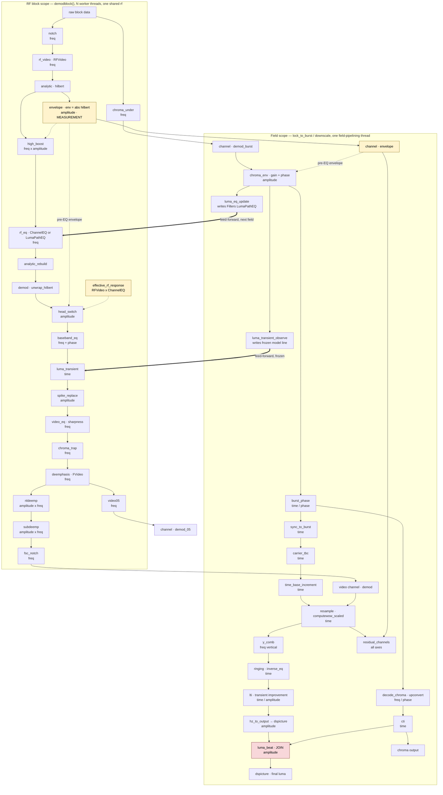

# The correction pipeline as a declared graph

A design for replacing the hardcoded procedural ordering of the correction
stages with a declared directed acyclic graph, one source of truth that both
executes the pipeline and renders it.

**Status: design only.** Nothing here is implemented. Every file:line
reference is to the tree as it stands at the time of writing, and every
claim about the current behaviour was read out of the code rather than
recalled. Where something is *not* verified it says so.

---

## 1. Why

### 1.1 The order is written twice, procedurally, in two hot methods

The runtime correction order exists only as the statement order of four
Python methods:

| Site | File | What it orders |
|---|---|---|
| `demodblock()` | `vhsdecode/process.py:1523-1807` | the RF-domain stages, per RF block |
| `_demodulate_to_video()` | `vhsdecode/process.py:1378-1521` | the post-demodulation baseband stages, per RF block |
| `lock_to_burst()` | `vhsdecode/field.py:1163-1203` | the per-field measurement stages |
| `downscale()` | `vhsdecode/field.py:1205-1320` | the per-field time-base and picture stages |

There is no registry, no stage list, and no configuration file. Adding a
correction means editing one of these methods; reordering two corrections
means moving statements inside one of them. The ordering constraints that
justify each position are recorded, carefully and at length, in comments —
see `process.py:1402-1406` on why the head-switch correction precedes
everything, or `process.py:1583-1590` on why the luma equalizer must follow
the envelope — but a comment is not a constraint. Nothing checks it, and
nothing can.

### 1.2 The consequence is already visible in the tree

Three concrete instances of the drift this invites, all found while
preparing this document:

- **The ringing stage documents a state store it does not use.**
  `vhsdecode/addons/ringing_cancellation.py:121-123` states that its
  cross-field state lives in `rf.field_averages.group_delay`, "so its
  lifetime and reset semantics stay owned by the existing state store."
  `FieldAverage` (`vhsdecode/field_averages.py`, exposed at
  `process.py:1111-1112`) has no `group_delay` member; the string appears
  nowhere else in the package except that comment. The actual store is a
  bare dictionary conjured at the call site,
  `rf.__dict__.setdefault("_ringing_state", {})` at `field.py:1274-1276`.
  It therefore has no owner for lifetime or reset at all — the opposite of
  what the comment promises.

- **The debug-plot menu has drifted from the plots that exist.** The user
  facing list at `vhsdecode/main.py:633-644` advertises nine plots. The
  code asks for twelve: `magdens` (`process.py:1658`) and `nldeemp` are
  requestable but undocumented.

- **Two neighbouring stages state contradictory reproducibility
  guarantees.** `head_switch.py:146-147` says single-threaded decodes are
  exactly reproducible; `ringing_cancellation.py:143-144` says the decode
  input is not bit-reproducible under threading. Both are probably true of
  their own scope, but nothing in the code relates the two claims.

None of these are bugs today. They are the signature of ordering and
lifetime knowledge that lives in prose beside the code rather than in a
structure the code reads.

### 1.3 What this design does and does not claim

It claims that a declared graph makes the ordering contract checkable, makes
the pipeline renderable without a hand-maintained diagram, and makes adding
a correction a data change rather than a surgery on two hot methods.

**It does not claim a meaningful speedup.** Section 7 works the parallelism
through honestly and concludes that the achievable gain is small, is zero on
a machine whose block-level pool is already saturated, and cannot be
quantified at all without a profile that has not been taken. Anyone reading
this proposal for throughput should read section 7 first and then stop.

---

## 2. Vocabulary

The offline model in `vhsdecode/information_extrapolation.py` already has
the right words for this, arrived at from the physics rather than from the
code. This design adopts them rather than inventing a parallel set.

| Term | Defined at | Meaning here |
|---|---|---|
| `Stage` | `information_extrapolation.py:94-96` | which half of the chain a node inverts: `rf_playback`, `rf_recording`, `picture` |
| `Axis` | `:109-116` | what the node acts on: `amplitude`, `frequency`, `time`, and the per-field dimension `field` |
| `Component` | `:178-226` | one identified part of the system: `name`, `ideal`, `resolution`, `residual`, `criterion`, `stage`, `machine`, `frozen` |
| `Gauges` | `:1040-1089` | the measurement protocol, including `feed_forward` |
| ordered executor | `:2252-2320` | iterates `STAGES` in order and feeds each stage's model forward before the next begins |

Two properties of that model carry over directly, and one does not.

**Carries over — the order is forced, not chosen.** The offline executor's
comment at `:91-93` states it exactly: "a machine can only be inverted once
everything that acted after it has been." The same principle already orders
the runtime stages; the runtime simply has no way to say so.

**Carries over — feed-forward is a first-class edge.** The offline executor
applies the previous stage's model before the next stage begins
(`:2303-2315`), because a stage that converges without feeding forward
would leave the next one measuring an uncorrected signal. The runtime has
exactly this pattern across fields (section 4.3) and, likewise, no way to
declare it.

**Does not carry over — linearity.** The offline executor is a linear chain
with no fan-out and runs offline on a whole capture. The runtime graph has
genuine forks (the chroma branch, the half-bandwidth copy), a genuine
cross-scope back-edge (section 4.4), and two concurrency scopes. The
vocabulary is reused; the executor is not.

### 2.1 The three kinds of edge

The single most important thing this design must get right is that not every
dependency is a data dependency. Three kinds exist, and conflating them is
how a well-meaning reordering breaks a correction.

- **Data edge** (`-->`). The consumer reads the producer's *output*. Moving
  the producer moves what the consumer sees. This is the ordinary case.

- **Measurement edge** (`-.->`). The consumer reads a quantity *measured at
  a particular point in the chain*, not the signal as it stands when the
  consumer runs. The measurement's position is the contract; the consumer's
  position is free. Section 4.1 works the two known instances.

- **Feed-forward edge** (`==>`). The producer writes state consumed by a
  *later field's* nodes, deliberately delayed. Section 4.3.

A declaration that records only data edges would be actively harmful: it
would license the executor to "optimise" a measurement edge into a data
edge and silently change what every amplitude-axis consumer sees.

---

## 3. Node inventory

Derived from the code. Every row cites the site it runs at. "Gate" is the
flag or attribute that enables the node; where a gate is a derived attribute
rather than a flag, the flag that ultimately sets it is given in
parentheses.

### 3.1 RF-block scope — `demodblock()`, run on N worker threads

Unit of work is one RF block. All N threads call `rf.demodblock()` on the
**same** `rf` object (`lddecode/core.py`, `DemodCache.worker`), which is
what makes every accumulator in section 10.1 shared.

| Node | Gate (default) | Axis | Site | Reads | Writes |
|---|---|---|---|---|---|
| `notch` | `--notch` (`None`) via `self._notch` | frequency | `process.py:1545-1546` | `indata_fft`, `Filters["FVideoNotchF"]` | `indata_fft`, in place |
| `rf_video` | always | frequency | `process.py:1549` | `indata_fft`, `Filters["RFVideo"]` | `indata_fft`, in place |
| `analytic` | always | — | `process.py:1561` | `indata_fft`, `Filters["hilbert"]` | `hilbert` |
| **`envelope`** | always | amplitude | `process.py:1565-1566` | `hilbert` | `env`, `env_mean` — **a measurement, see 4.1** |
| `high_boost` | `--high_boost` (format default) via `self._high_boost` | frequency × amplitude | `process.py:1570-1579` | `indata_fft`, `env`, `Filters["RFTop"]` | `indata_fft` |
| `rf_eq` | `--channel_eq` (`0`) → `Filters["ChannelEQ"]`, else `--luma_eq` (`0`) → `Filters["LumaPathEQ"]` | frequency | `process.py:1591-1611` | `indata_fft`, `Filters` | `indata_fft` |
| `analytic_rebuild` | conditional on the two nodes above | — | `process.py:1615-1616` | `indata_fft` | `hilbert` |
| `demod` | always | — | `process.py:1400` | `hilbert` | `demod` |
| `head_switch` | `--head_switch` (`0`) | amplitude | `process.py:1408-1412` → `head_switch.py:570` | `demod`; **`env` (pre-EQ)**; `luma_amplitude.block_model(rf)`; `channel_eq.effective_rf_response` | `demod` in place; accumulator `_head_switch_cal`; returns an IRE trace |
| `baseband_eq` | `--baseband_eq` (`0.5`) **and** a declared measurement file | frequency + phase | `process.py:1421-1430` → `baseband_eq.py:644` | `demod`; cached `E(f)` | `demod` in place; returns an IRE trace |
| `luma_transient` | `--luma_transient` (`0`) | time | `process.py:1438-1439` → `luma_transient.py:364` | `demod`; frozen model from `observe` | `demod` in place |
| `spike_replace` | `--nodd` inverse; `diff_demod_check_value` | amplitude | `process.py:1443-1451` | `demod`, `hilbert` | new `demod` |
| `video_eq` | `--sharpness` (`0`) via `self._video_eq` | frequency | `process.py:1461-1463` | `demod` | new `demod` |
| `chroma_trap` | `--chroma_trap` (`False`) | frequency | `process.py:1466-1468` | `demod` | new `demod` |
| `deemphasis` | always | frequency | `process.py:1471-1484` | `demod`, `Filters["FVideo"]` | `out_video`, `demod_fft` |
| `nldeemp` | `--nld` (`False`) | amplitude × frequency | `process.py:1486-1498` | `out_video_fft` | `out_video` |
| `subdeemp` | `--sd` (`False`) or format | amplitude × frequency | `process.py:1500-1512` | `out_video`, `out_video_fft` | `out_video` |
| `fsc_notch` | `self._use_fsc_notch_filter` | frequency | `process.py:1516-1519` | `out_video` | `out_video` |
| `video05` | always | frequency | `process.py:1637-1638` | `demod_fft` | `out_video05` |
| `chroma_under` | `color_under` (derived, `process.py:788`) | frequency | `process.py:1642-1656` | **raw `data`** when colour-under, else `out_video` | `out_chroma` |

### 3.2 Field scope — `lock_to_burst()` and `downscale()`, one thread

Run on the single field-pipelining thread (`lddecode/core.py:4186`,
mirrored at `process.py:533-536`), which overlaps field *N+1*'s decode with
field *N*'s downscale and write. Within a field these run strictly serially.

| Node | Gate (default) | Axis | Site | Reads | Writes |
|---|---|---|---|---|---|
| `chroma_env` | `--chroma_env_gain` (`1`), `--chroma_env_phase` (`1.0`) | amplitude (+ phase) | `field.py:1171` → `chroma.py:517` | `video["envelope"]`, `video["demod_burst"]` | the field's colour-under copy, in place, once |
| `luma_eq_update` | `--luma_eq` (`0`) | frequency | `field.py:1178-1179` → `luma_amplitude.py:2010` | per-head accumulated response | `rf.Filters["LumaPathEQ"]` — **feed-forward, 4.3** |
| `luma_transient_observe` | `--luma_transient` (`0`) | time | `field.py:1185-1186` → `luma_transient.py:349` | measured amplitude deviation | `_luma_transient_line`, write-once — **feed-forward** |
| `burst_phase` | `write_chroma` (derived) | time / phase | `field.py:1198-1202` → `chroma.py:1845` | the field's chroma | `rf.track_phase`, `phase_sequence`, burst averages |
| `sync_to_burst` | `--disable_burst_hsync` inverse | time | `field.py:2385-2393`, `:2465` | `linelocs`, burst phases | `linelocs` |
| `carrier_tbc` | `--carrier_tbc` (`0`) | time | `field.py:1217-1221` → `carrier_tbc.py:466` | `demod_raw`, `block_model` | returns new `linelocs`; caller swaps at `field.py:1231-1233` |
| `time_base_increment` | `--time_base_response` file | time | `field.py:1225-1230` → `carrier_tbc.py:395` | `linelocs`, the npz | new `linelocs` |
| `resample` | always | time | `field.py:1237` (parent `downscale`) | `linelocs`, `demod` | `dsout`, `wowfactors` |
| `y_comb` | `--y_comb` (`0`) | frequency (vertical) | `field.py:1241-1243` | `dsout` | `dsout` |
| `ringing` | `--inverse_eq` (`-1`), or the `hsync_model` plot | time | `field.py:1261-1285` → `ringing_cancellation.py:6219` | `dsout`, geometry, two reference levels, `_ringing_state` | `dsout`; `_ringing_state`; returns `lti_params` |
| `lti` | `--lti_gain` (`None` = auto), gated by `--inverse_eq` | time / amplitude | `field.py:1303-1309` | `dsout`, `lti_params` | `dsout`, in place |
| `residual_channels` | `--residual_channels` (`None`) | all | `field.py:1311-1315` → `residual_channels.py:306` | every carried channel, `wowfactors` | one npz per field, to disk |
| `hz_to_output` | always | amplitude | `field.py:1317-1318` | `dsout` | `dspicture` |
| `decode_chroma` | `write_chroma` (derived) | frequency / phase | `field.py:2496` etc. → `chroma.py:3048` | the field's chroma buffer | `uphet` |
| `cti` | `--cti_mix` (`1`) | time | `chroma.py` (chroma transient improvement) | chroma | chroma |
| **`luma_beat`** | `--luma_beat` (`0`) **and** burst magnitude gate (`chroma.py:2691`) | amplitude | `chroma.py:3063-3064` → `luma_beat.py:272` | `uphet`, `chroma_under_tbc`, **`field.dspicture`** | **`field.dspicture` in place** (`luma_beat.py:309`) — **back-edge, 4.4** |

Note the default column. Only `chroma_env_gain`, `chroma_env_phase`,
`cti_mix` and `baseband_eq` are on by default; `baseband_eq` defaults to
`0.5` and is inert without a measurement file. Everything else in the
correction set is default-off. This is why the rendered graph must
distinguish *enabled* from *available* (section 5.3) — on a typical decode
most of the boxes are dark.

---

## 4. The true dependencies

### 4.1 Measurement edges: the envelope, and the effective RF response

**The envelope.** `env` is taken at `process.py:1565`, from the analytic
signal built at `:1561` — that is, from the signal after `RFVideo` but
**before** the equalizer applies at `:1611`. This is deliberate and the
reason is recorded at `:1583-1590`:

> The envelope is a MEASUREMENT of the tape — it is what the color-under
> correction reads the head-to-tape loss from, and what dropout detection
> thresholds against — so a correction applied to the luma must not reach
> it.

with a measured cost for getting it wrong, also at `:1588-1590`: folding the
equalizer in with `RFVideo` instead "costs 17% of the chroma correction's
benefit to buy 1.8% on the luma."

The consequence for the graph is precise. Three consumers —
`head_switch` (`process.py:1409-1412`, passing `envelope=env`),
`chroma_env` (`chroma.py:517`, via the carried `envelope` channel), and
dropout detection (`doc.py:76`, `doc.py:161`) — depend on the **pre-EQ**
signal even though all three run *after* the equalizer in execution order.
Their edge points at the `envelope` node, not at `rf_eq`. An executor that
inferred edges from execution order would get all three wrong.

**The effective RF response.** `channel_eq.py:237-247` states the second
rule:

> Anything that models the pre-demodulator path from the stored filter […]
> must read this instead of `Filters["RFVideo"]`, or it models a path that
> no longer exists once the table is applied. The ENVELOPE, by contrast, is
> still taken from `RFVideo` alone: the table is applied after it,
> deliberately.

Two runtime consumers honour it: `head_switch.py:173` and
`luma_beat.py:150`, both calling `channel_eq.effective_rf_response(rf)`.
So `Filters["RFVideo"]` and `effective_rf_response` are **two distinct
nodes** in the graph, and which one a stage reads is part of its
declaration. This is exactly the kind of contract that today is enforced
only by a docstring and the diligence of the next author.

### 4.2 The genuine forks

Within a block, three branches leave the trunk:

- `video05` (`:1637`) forks from `demod_fft` and is independent of the
  entire de-emphasis tail (`nldeemp`, `subdeemp`, `fsc_notch`).
- `chroma_under` (`:1642-1656`) reads the **raw block** `data` when
  colour-under is in force, so it is independent of the whole luma chain —
  every stage from `notch` to `fsc_notch`. On non-colour-under formats it
  reads `out_video` instead and the fork disappears.
- `unequalized` (`:1632-1635`) is a second, complete run of
  `_demodulate_to_video` on the pre-equalizer analytic signal, built only
  when `--residual_channels` or the `luma_noise` plot asked for it. It is
  genuinely parallel with the main pass and is also, by construction,
  diagnostic-only.

Within a field, one fork of consequence: the luma tail
(`resample` → `y_comb` → `ringing` → `lti` → `hz_to_output`) and the chroma
chain (`decode_chroma` → `cti`) are independent of each other — until the
back-edge below.

### 4.3 Feed-forward edges

Two field-scope nodes write state that the **next** field's RF blocks read:

- `luma_eq_update` writes `rf.Filters["LumaPathEQ"]`
  (`luma_amplitude.py:2069`). The delay is deliberate and explained at
  `field.py:1174-1177`: the equalizer is fitted where the head is known and
  applied a field later "because that is the soonest a demodulator running
  ahead of field assembly can be told which head is coming."
- `luma_transient_observe` writes the model line
  (`luma_transient.py:360`, via `setdefault` — write-once).

`luma_transient.py:284-290` gives the reason the model is *frozen* rather
than continuously updated, and it is the single best statement in the tree
of the constraint this whole design must respect:

> `demodblock` runs in its own thread and ahead of field assembly, so it
> cannot know which head wrote the block it is holding, and a model that
> kept changing would be read at a different version by every block — which
> is precisely the defect that made `--luma_eq` irreproducible at one
> thread.

This is the precedent the DAG should generalise: **state crossing from field
scope to block scope must be frozen at a declared point, not continuously
mutated.** Section 8.2 turns it into a declared rule.

### 4.4 The back-edge, and why the graph is still acyclic

`luma_beat.correct` reads `field.dspicture` and **writes it in place**
(`luma_beat.py:307-309`), after `hz_to_output` has already converted the
luma to output units at `field.py:1317-1318`. The chroma chain therefore
feeds back into the luma picture buffer.

This is correct and deliberate — `luma_beat.py:274-277` explains that this
is "the only place the decoded saturation does [exist] and where both planes
already sit on one grid" — but it means the naive picture of "luma chain,
then chroma chain" is wrong. At node granularity the graph remains acyclic:
`decode_chroma` → `luma_beat` → (final `dspicture`). It is only cyclic if
one collapses the luma and chroma chains into two aggregate nodes, which is
precisely the mistake a hand-drawn diagram makes.

A declared graph must therefore model `luma_beat` as a **join** of the luma
tail and the chroma chain, and place the true end of the field pipeline
after it. This also fixes the join point for any concurrent execution of
the two branches (section 7.3).

---

## 5. The graph as a debug plot

The configuration must drive a rendered graph, and that rendering must be
**generated from the very declaration the executor runs**. This is a
first-class requirement, not documentation tooling.

### 5.1 One source of truth, two consumers

```
                 stages.toml  (the declaration)
                      │
          ┌───────────┴───────────┐
          ▼                       ▼
      execute()               render()
   the real pipeline       the pipeline_graph plot
```

The property to hold onto: **`render()` has no knowledge of the pipeline
except the declaration `execute()` runs.** There is no second list, no
hand-maintained diagram, no docstring that has to be kept in step. A stage
that is not in the declaration cannot run, and cannot appear in the plot; a
stage in the declaration appears in both or neither.

Section 1.2 is the argument for insisting on this. The repository already
contains a menu that drifted from its code (`main.py:633-644` versus the
twelve names actually requested) and a docstring that describes a state
store that does not exist (`ringing_cancellation.py:121-123`). A diagram
maintained beside the pipeline would drift the same way and would be worse
than none, because a diagram is *trusted* in a way a comment is not.

### 5.2 It joins the existing debug-plot system

The mechanism is already minimal and needs no extension. `DebugPlot`
(`debug_plot.py:10-15`) holds a whitespace-separated, case-folded list and
answers `is_plot_requested(name)`. `--debug_plot` / `--dp` is wired at
`main.py:645-652` and constructed at `main.py:932-936`.

**Proposed name: `pipeline_graph`.** It matches the existing descriptive
snake_case convention (`luma_noise`, `hsync_model`, `sync_step_fold`,
`luma_averaging`) and is unambiguous about what it shows. It must be added
to the menu string at `main.py:633-644` — or, better, that string should
itself be generated, which would close the drift noted in section 1.2.

**One wiring problem must be solved, and it is not cosmetic.**
`main.py:1017` reads:

```python
threads=args.threads if not debug_plot else 0,
```

Any debug plot at all forces a single-threaded decode. For the existing
plots that is right: they draw per-block or per-field signal data and would
be unreadable interleaved. For `pipeline_graph` it is wrong twice over.
First, the graph is structural — it is derived from the declaration and
costs nothing per block — so the penalty buys nothing. Second, and worse,
if the plot is to double as a profile (section 5.3) then forcing
`threads=0` makes it profile a pipeline that is *not the one the user
runs*, which defeats the purpose.

The fix is to distinguish plots that require serialisation from plots that
do not. Concretely: give `DebugPlot` a set of names that do not force
serialisation, and make `main.py:1017` consult it, so that
`--debug_plot pipeline_graph` alone leaves `--threads` untouched while
`--debug_plot pipeline_graph luma_noise` still serialises on `luma_noise`'s
account. This is a small change and it is a prerequisite, not an extra.

### 5.3 What the plot shows

Structure alone would be documentation. These are what make it a debug tool,
separated honestly by what they cost.

**Free — known from the declaration and the options object, before a single
sample is read:**

- **Enabled versus available.** Every node, with the ones actually active
  for *this* decode distinguished from the ones merely compiled in. Given
  the default column in section 3, on a typical decode most nodes are dark;
  seeing which few are lit is the single most useful thing the plot can
  say. The gate expression and its resolved value should appear on the node
  — `--head_switch 0` reads very differently from `--baseband_eq 0.5,
  inert: no measurement file`.
- **The axis** each node acts on, in the `Axis` vocabulary of section 2,
  rendered as node colour or shape. A reader can then see at a glance that,
  say, three amplitude-axis nodes are active and no time-axis node is.
- **The scope** each node runs in — RF block, field, or cross-field — as
  subgraph boxes, since this is what governs both the concurrency and the
  reproducibility hazards.
- **The edge kinds** of section 2.1, distinctly drawn. A measurement edge
  that visibly reaches back past three stages to the `envelope` node is a
  far better explanation of `process.py:1583-1590` than the comment is.

**Cheap — a name, not a measurement:**

- **What each node reads and writes**, as declared. This is the `reads` /
  `writes` of section 3, which the declaration must carry anyway for the
  executor to order the graph. Rendering it costs nothing beyond label
  space. Note that it shows the *declared* contract, not observed traffic —
  it will show that `head_switch` declares a read of `envelope`, not that
  it performed one.

**Not free — say so plainly:**

- **Per-stage timing.** Genuinely valuable — it would make the plot double
  as a profile and would settle the questions section 7 has to leave open —
  but it is a measurement, not a declaration. Wrapping every node in a
  timer perturbs what it measures, and doing so per RF block across N
  worker threads needs per-thread accumulation and a merge. The honest
  design is: timing is **opt-in and separate**, gated behind its own flag
  (`pipeline_graph` renders structure; something like
  `--pipeline_profile` adds accumulated per-node wall time and call count),
  and the rendered output must state which mode produced it so a structural
  render is never mistaken for a profile. Until that exists, no timing
  number should appear on the plot at all.

### 5.4 Format and destination

**Recommendation: emit Mermaid, to a file, and print the path.**

- It is text, so it diffs in git. A reviewer can see that a pull request
  changed the pipeline's shape, which is exactly the review that the
  current arrangement makes impossible.
- The repository's own tooling already renders it. `pymdownx.superfences`
  is enabled at `mkdocs.yml:39`, which is the prerequisite for Mermaid in
  mkdocs-material; GitHub renders ```` ```mermaid ```` fences natively with
  no configuration at all. (Honest caveat: `mkdocs.yml` does not yet carry
  the three-line `custom_fences` block that points superfences at Mermaid.
  That is a small addition, and it is needed for the docs site but not for
  GitHub.)
- It requires no new dependency. The current requirement set
  (`requirements.txt`) has no graph library, and emitting text needs none.

The counter-argument for a rendered image is immediacy — the other debug
plots open a matplotlib window and the user sees the answer at once. This
is a real cost and the design should not pretend otherwise. The mitigation
is to print the output path prominently, and to keep the Mermaid source
small enough to paste. A rendered fallback is available without a new
dependency, since matplotlib is already required: a simple layered
box-and-arrow rendering by scope. It is proposed as a **fallback**, not the
primary, because it is not diffable and would itself need maintaining.

Destination: alongside the decode's other outputs, named from the output
basename — `<output>.pipeline.mmd` — so it sits with the `.tbc` and the
JSON it describes, and so two decodes with different flags produce two
diffable files.

---

## 6. The mermaid diagram

Edge kinds follow section 2.1: solid is a data edge, dotted is a measurement
edge, thick is a cross-field feed-forward edge.



Two things the diagram is meant to make unmissable, both of which the code's
execution order actively hides: the dotted edges reaching **backwards** from
`head_switch` and `chroma_env` to the pre-EQ `envelope`, and the red
`luma_beat` join where the chroma branch re-enters the luma.

---

## 7. Parallelism — the honest analysis

### 7.1 What concurrency exists today

Verified, not assumed:

- **Block-level parallelism already exists.** `DemodCache`
  (`lddecode/core.py:1079`) is a hand-rolled pool of `threading.Thread`
  workers — threads, not processes — created at `:1129-1134` from
  `num_worker_threads`, which `process.py:170` supplies from
  `self.numthreads`. `-t/--threads` defaults to `DEFAULT_THREADS + 1` = 5
  for the CLI (`cmdcommons.py:14`, `:150`, `:250-257`). The unit of work is
  one RF block, dispatched through `q_in` and returned through `q_out`.
- **Field pipelining exists.** One thread decodes field *N+1* while field
  *N* is downscaled and written (`lddecode/core.py:4186`;
  `process.py:533-536`).
- **Within a field, and within a block, everything is serial.** There is no
  fan-out across stages anywhere.
- **`self._processing_thread_pool` is pre-plumbed and entirely unused.**
  Created at `process.py:108` with `max_workers=threads + 1`, passed to
  `VHSRFDecode` at `:144`, stored at `:685`, shut down at `:429-430`. A
  grep for `.submit(` and `.map(` across `vhsdecode/` and `lddecode/`
  returns nothing. It has never had a task submitted to it.

### 7.2 What the GIL actually permits

The brief's framing — that the GIL is released by numba and Rust — is true
but incomplete, and the incompleteness matters for the estimate.

- **numba.** 76 `nogil=True` against 90 `@njit` in `vhsdecode/` and
  `lddecode/`. There is **no** `parallel=True` and no `prange` anywhere;
  the two greps return only unrelated `exprange` identifiers.
- **Rust.** Every `#[pyfunction]` in `src/lib.rs` wraps its body in
  `py.detach(...)` — `:128`, `:145`, `:155`, `:183`, `:196` — **except
  one**. `fallback_vsync_loc_means` (`:159-172`) holds the GIL: its
  `py.allow_threads` call is commented out at `:169` and the
  implementation is handed `py` directly. It is a sync-detection fallback
  rather than a hot path, but the claim "every pyfunction detaches" is not
  quite true and a design should not rest on it.
- **numpy and scipy, which the brief omits and which dominate.** The
  heaviest work in `demodblock` is not numba or Rust at all: it is
  `npfft.fft` / `rfft` / `irfft` (`:1532`, `:1471`, `:1484`, `:1637`),
  large-array complex arithmetic, `np.abs` (`:1565`), and
  `sps.filtfilt` (`:1517`). These release the GIL in their own C loops.
  So the GIL is largely released in the hot path — but by numpy's and
  scipy's C code, and any speedup estimate rests on that far more than on
  the numba and Rust annotations.

What does **not** release the GIL, and cannot: every `if
self.options.X != 0:` test, every `Filters.get`, every `getattr`, the video
dict construction at `:1715-1789`, the channel slicing at `:1791-1798`, and
every Python-level function call between stages. A DAG executor **adds** to
this category — node lookup, dependency resolution, future creation and
result marshalling are all pure Python. The orchestration overhead is on
the wrong side of the ledger.

### 7.3 What could genuinely run concurrently

**Within a block: very little, and it is the wrong little.** From section
4.2 the forks are `video05`, `chroma_under`, and the diagnostic
`unequalized` pass. Against them stands a trunk of roughly a dozen serial
stages including several full-length FFT/IFFT pairs. `chroma_under` is one
filter bank; `video05` is one inverse transform and a roll. Even granting
perfect scheduling and full GIL release, Amdahl's law bounds the saving at
the smaller branch's share of block time — structurally a small
single-digit percentage. It has **not been measured** here, so no number is
offered.

**And that saving is very probably zero anyway.** This is the decisive
point and it deserves to be stated bluntly. The block-level pool already
runs 5 blocks concurrently by default. On any machine where `--threads`
meets or exceeds the core count, the cores are *already* saturated with
block-level work. Splitting each block internally then redistributes the
same work across the same cores while adding synchronisation — it can only
lose. Intra-block fan-out can help only when the block pool is starved:
at the very start and end of the file, under `--threads 1`, or when a debug
plot has forced `threads=0` (`main.py:1017`). None of those are the case
worth optimising.

**Within a field: one real fork, on the part that is actually serial.**
The field-pipelining thread is a genuine serial bottleneck — there is
exactly one of it, and `ringing_cancellation.process_field` and the whole
chroma chain both run on it. Section 4.2 established that the luma tail and
the chroma chain are independent, and section 4.4 established that
`luma_beat` is their join. So they could run on two threads and join before
`luma_beat`. **This is the only place in the pipeline where a DAG executor
could plausibly earn a measurable win**, because it parallelises work that
is currently serial rather than re-slicing work that is already parallel.

Its ceiling is Amdahl's again: if the chroma chain is a fraction *c* of the
field-serial time, the saving is bounded by `min(c, 1 - c)`, maximised at 50
% split for a 2× on that section only — and the field-serial section is
itself only part of the decode, overlapped with the next field's demod.

***c* has not been measured.** No profile of the field-serial section exists
in this tree, and guessing one would defeat the purpose of saying so. The
measurement that would settle it is stated in section 7.5.

### 7.4 The honest estimate

- **Intra-block fan-out: expect no speedup.** Zero when the block pool is
  saturated, which is the default configuration. Do not build it.
- **Intra-field fan-out (luma tail ∥ chroma chain): unknown, plausibly
  worthwhile, bounded by `min(c, 1-c)` on the field-serial section
  only.** Worth measuring before building.
- **DAG orchestration overhead: a real cost, paid on every node of every
  block.** With ~20 block-scope nodes and blocks arriving at the rate the
  decode consumes them, per-node Python dispatch is not free. This is why
  section 8.3 proposes that the declaration be *compiled* once into a
  straight-line closure rather than interpreted per block.
- **Overall: the rearchitecture should be justified on maintainability and
  the ordering contract, not on throughput.** If it comes out
  performance-neutral it has succeeded.

One further caution, from prior measurement on this repository: FPS numbers
are meaningless unless runs are interleaved and no other decode is running,
and the numba JIT must be warmed first. An "11 % regression" measured here
previously turned out to be parallel-session load.

### 7.5 The measurement that would settle it

Before any concurrency work: accumulate per-node wall time for one field's
serial section, split between the luma tail
(`resample`…`hz_to_output`) and the chroma chain
(`decode_chroma`…`cti`), on both a `--inverse_eq`-enabled decode and a
default one, single-threaded, JIT warm. That yields *c* directly. If *c* is
below roughly 0.15 or above roughly 0.85 the fork is not worth building.
This is the same instrumentation the `--pipeline_profile` mode of section
5.3 would provide, which is an argument for building that first.

---

## 8. The configuration format

### 8.1 Choice of format

**TOML**, read with the standard library's `tomllib`. `pyproject.toml:10`
declares `requires-python = ">=3.11"`, and `tomllib` entered the standard
library in 3.11 — so this adds **no dependency** to a requirement set
(`requirements.txt`) that currently contains no configuration library at
all. It is also the format the project already uses for `pyproject.toml`
and `Cargo.toml`.

It satisfies the standing preference for one readable configuration file per
tool, with no knobs buried in a large JSON blob and no behaviour reachable
through shell environment variables.

### 8.2 What a declaration contains

Each node declares its identity, its gate, its position in the chain, and —
critically — its edges *by kind*. The executor derives execution order by
topological sort over data edges, and validates measurement and
feed-forward edges rather than reordering across them.

```toml
# vhsdecode/pipeline/stages.toml
#
# The correction pipeline. This file is the single source of truth: the
# executor runs it and the pipeline_graph plot renders it. There is no
# second list.

[meta]
version = 1

# ---------------------------------------------------------------------
# The measurement nodes. These exist so that consumers can depend on a
# quantity taken at a specific point rather than on whatever the signal
# happens to be when they run.
# ---------------------------------------------------------------------

[[node]]
name    = "envelope"
scope   = "rf_block"
stage   = "rf_playback"
axis    = ["amplitude"]
gate    = "always"
site    = "vhsdecode/process.py:1565"
reads   = ["hilbert"]
writes  = ["env", "env_mean"]
kind    = "measurement"
# Taken from the analytic signal built at :1561 - after RFVideo, BEFORE
# rf_eq at :1611. Folding the equalizer in ahead of this was measured to
# cost 17% of the chroma correction to buy 1.8% on the luma
# (process.py:1583-1590). Consumers bind to THIS node, never to rf_eq.
frozen_before = "rf_eq"

# ---------------------------------------------------------------------
# One correction stage, in full.
# ---------------------------------------------------------------------

[[node]]
name  = "head_switch"
scope = "rf_block"
stage = "rf_playback"
axis  = ["amplitude"]

# The gate, as an option name and the predicate that enables it. The
# renderer prints the resolved value beside the node, so a reader sees
# "--head_switch 0 (off)" or "--head_switch 1.0 (on)" without guessing.
gate  = { option = "head_switch", predicate = "!= 0", default = 0 }

entry = "vhsdecode.head_switch:correct"
site  = "vhsdecode/process.py:1408-1412"

# Data edges: consumed and produced signal.
reads  = ["demod"]
writes = ["demod"]
mutates_in_place = true

# Measurement edges. These are NOT data edges: the executor must not
# reorder across them, and must refuse to start if the named node is
# absent or has not yet been taken.
measures = [
  { node = "envelope",              as = "envelope" },
  { node = "effective_rf_response", as = "rf_response" },
]

# Cross-scope state this node reads. Declared so the reproducibility
# audit of section 10.1 can find every accumulator without grepping.
consumes_model = ["luma_amplitude.block_model"]

# Shared mutable state this node writes. `race = "accepted"` records
# that the lost-update hazard is known and tolerated; the executor
# refuses to enable more than one worker thread for a node marked
# `race = "forbidden"`. (TOML inline tables must each sit on one line.)
accumulates = [
  { key = "_head_switch_cal", race = "accepted", note = "head_switch.py:143-147" },
]

# Ordering constraints, asserted rather than implied by file position.
# The executor verifies these after the topological sort and refuses to
# run if one is violated.
must_precede = ["baseband_eq", "luma_transient", "deemphasis"]
must_follow  = ["demod"]

# Prose for the rendered plot. One sentence, shown on hover or as a
# subtitle - the physics, not the mechanism.
why = """
The phase partner of the carrier amplitude residual - AM-induced noise,
with head switch steps and dropout edges as its coherent extremes. The
artifact is introduced after the tape is read, so it is removed before
every stage that corrects what lies underneath it.
"""
```

For comparison, a field-scope node with a feed-forward edge:

```toml
[[node]]
name  = "luma_eq_update"
scope = "field"
stage = "rf_playback"
axis  = ["frequency"]
gate  = { option = "luma_eq", predicate = "!= 0", default = 0 }
entry = "vhsdecode.luma_amplitude:update_luma_equalizer"
site  = "vhsdecode/field.py:1178-1179"

# The defining property: this writes state that the NEXT field's RF
# blocks read. The delay is deliberate (field.py:1174-1177) - the fit
# needs the head, and a demodulator running ahead of field assembly
# cannot be told which head is coming until a field later.
feeds_forward = [
  { target = "rf_eq", via = "Filters.LumaPathEQ", delay = "one_field", freeze = "field_boundary" },
]
```

`freeze = "field_boundary"` is the generalisation of the rule section 4.3
extracted from `luma_transient.py:284-290`: state crossing from field scope
to block scope is snapshotted at a declared point, so every block in a field
reads one version. The executor enforces it; today it is a convention that
one module happened to follow and others need not.

### 8.3 What the executor does with it

1. **Load and validate** once at startup. Resolve gates against the options
   namedtuple (`process.py:800-907`). Topologically sort the data edges.
   Verify every `must_precede` / `must_follow`. Verify every `measures`
   target exists and is produced before its consumer. Fail loudly here,
   where it is cheap, rather than producing a subtly wrong decode.
2. **Compile, do not interpret.** Emit a straight-line closure per scope
   containing only the enabled nodes, built once. This keeps the
   per-block cost at roughly today's — a sequence of direct calls — instead
   of paying graph traversal on every block. It is also what makes
   byte-identical output achievable (section 9, step 4), since the compiled chain
   for the default configuration is the current chain.
3. **Render** from the same loaded declaration plus the resolved gate
   values, for `--debug_plot pipeline_graph`.

---

## 9. Migration

The governing constraint: **the current path stays byte-identical while the
DAG is opt-in.** Every step below is independently revertible, and no step
changes decoded output until step 5 is deliberately enabled.

**Step 1 — Declare, do not execute.** Write `stages.toml` describing the
pipeline exactly as it runs today, and a loader that validates it. Nothing
consumes it yet. This step alone has value: validation of `must_precede`
against the real order is a test that the declaration is honest, and it
cannot change behaviour because nothing runs it.

**Step 2 — Render.** Implement `--debug_plot pipeline_graph` on the
declaration from step 1, together with the `main.py:1017` fix from section
5.2 that lets a structural plot run without forcing `threads=0`. Now the
declaration has a consumer that makes its accuracy visible, and reviewers
get a diffable picture of the pipeline. Still no effect on decoded output.

**Step 3 — Shadow-execute.** Add the compiled executor behind a default-off
flag — `--pipeline_dag`, defaulting to off, in the same style as the
existing `nargs="?"` correction flags. When off, `demodblock` and
`downscale` run exactly the code they run today, untouched. When on, the
compiled chain runs instead.

**Step 4 — Prove equivalence.** The acceptance test is a **bit-exact
comparison** of `.tbc` output between `--pipeline_dag` off and on, over the
same input, single-threaded (`--threads 0`), with several flag
combinations: all corrections off; each correction alone; and the
default-on set (`--chroma_env_gain`, `--chroma_env_phase`, `--cti_mix`,
`--baseband_eq` with and without a measurement file). Single-threaded is
essential — section 10.2 explains why a threaded comparison cannot be
bit-exact today and so cannot serve as the oracle.

**Step 5 — Flip the default, keep the escape hatch.** Only once step 4
passes on both test tapes. Retain `--pipeline_dag 0` as a way back for at
least one release; keep the procedural path in the tree, unmodified, until
the declared path has decoded real material for a while.

**Step 6 — Concurrency, if and only if section 7.5 justifies it.** The
luma ∥ chroma field fork, submitted to the pool at `process.py:108` that
already exists and has never been used. Behind its own flag, default off,
measured before and after with interleaved runs on an otherwise idle
machine.

Steps 1 and 2 are worth doing on their own merits even if steps 3-6 are
never taken. That is deliberate: it means the first half of this proposal
can be evaluated without committing to the second.

---

## 10. Risks

### 10.1 The stale-accumulator hazard

**The hazard, as the code already states it.** Both documented instances,
quoted:

`head_switch.py:143-147`:

> The calibration accumulates as blocks are demodulated; under threading a
> block may read sums a few blocks stale and increments may race
> (lost-update class, the same accepted caveat as the equalizer's shared
> state) — single-threaded decodes are exactly reproducible.

`ringing_cancellation.py:142-146`:

> The margins are deliberately generous: the decode input is not
> bit-reproducible under threading, and a health verdict that flips on a
> marginal field re-seeds the averages one field late and shifts the early
> output (measured on the home tape as a ~0.2 IRE transient over twelve
> fields).

Note that these are *different* claims. The first says its own accumulator
races but that single-threaded decodes are exact; the second says the input
it receives is already not bit-reproducible under threading, and quantifies
the downstream consequence. Both can hold — the ringing stage runs on the
field thread and inherits nondeterminism from the block stage upstream — but
nothing in the code connects them, and no single place states the pipeline's
overall reproducibility guarantee. **The declaration should be that place.**

**The scope is wider than those two modules.** Every rf-scope accumulator
is shared across the worker threads, because all of them call
`rf.demodblock()` on the same `rf` object. The inventory:

| Store | Kind | Written | Read |
|---|---|---|---|
| `_head_switch_cal` | accumulator | `head_switch.py:292` | `:268`, `:515` |
| `_luma_eq_lines`, `_luma_dense_response`, `_luma_level_state`, `_luma_eq_expected`, `_luma_eq_trust`, `_luma_eq_reliability` | accumulators | `luma_amplitude.py:1521`, `:1695`, `:1740`, `:2100` | `:1440`, `:1469`, `:2032`-`:2068`, `luma_transient.py:274` |
| `_luma_beat_sums` | accumulator, frozen after a fixed field count | `luma_beat.py:336-341`, `:351` | `:329`, `:380`, `:391` |
| `_time_base_prior_state` | per-head regression accumulator | `carrier_tbc.py:202-204` | `:236` |
| `_ringing_state` | the ringing stage's whole cross-field state | created at `field.py:1274-1276` | `ringing_cancellation.py:6232` |
| `_luma_block_model` | replaced per field | `luma_amplitude._refresh_block_model` | `:1130` |
| `_luma_transient_model`, `_luma_transient_line` | **write-once, frozen** | `luma_transient.py:345`, `:360` | `:297`, `:299` |
| caches: `_baseband_eq`, `_baseband_eq_site`, `_baseband_eq_products`, `_time_base_response_table`, `_head_switch_kernels`, `_channel_eq` | idempotent caches | various | various |

The last two rows are the safe ones, and they are safe for different
reasons: write-once frozen state, and idempotent caches of file-derived
data. The rows above them are the hazard.

**What this design does about it.** Four things, in decreasing order of
confidence:

1. **Make it declared and therefore auditable.** The `accumulates` key of
   section 8.2 forces every node to name the shared state it writes and to
   classify the race as `accepted` or `forbidden`. Today the only way to
   find this table is to grep `rf.__dict__` across the package. A node that
   writes shared state without declaring it fails validation.
2. **Give `_ringing_state` an owner.** Section 1.2 established that it has
   none, and that its docstring names a store that does not exist. The
   declaration is the natural place to state its lifetime and reset
   semantics, and step 1 of the migration should correct the docstring
   whether or not the rest is built.
3. **Generalise the freeze rule.** `freeze = "field_boundary"` (section
   8.2) makes `luma_transient`'s discipline available to every
   field-to-block edge instead of being one module's private convention.
   This is the mechanism that made `--luma_eq` reproducible and it should
   not be re-derived per stage.
4. **Refuse to make it worse.** The executor must not introduce fan-out
   across nodes that share an accumulator. A node marked
   `race = "forbidden"` pins its scope to one worker. Concretely: the
   field-level luma ∥ chroma fork of section 7.3 is safe on this count
   because the luma tail and the chroma chain touch disjoint state — but
   that must be *checked against the declaration*, not asserted.

**What this design explicitly does not do: fix the existing races.** The
`accepted` markings record today's tolerated behaviour. Converting them to
`forbidden` — by locking, by per-thread accumulation with a deterministic
merge, or by moving the accumulation off the block path — is a separate
piece of work with its own correctness argument, and folding it into a
rearchitecture would make the byte-identical acceptance test of step 4
impossible to satisfy. It should be done afterwards, against a pipeline
whose state is at least declared.

### 10.2 Reproducibility

**The oracle problem.** Step 4's bit-exact comparison is only meaningful
single-threaded, because threaded decodes are not bit-reproducible today —
`ringing_cancellation.py:143-144` says so outright. This is a real
limitation on the migration: it can prove the declared path equals the
procedural path *under conditions that remove the existing nondeterminism*,
and no more. A threaded A/B can only be compared statistically. This should
be stated in the acceptance criteria rather than discovered during review.

**The ±1 LSB rule applies.** Single-field, ≤1 LSB differences between runs
are run noise, not regressions; a re-run decides. The acceptance test must
be exact-or-fail on a single-threaded comparison, and must not be run
threaded and then argued about.

**Two test tapes, not one.** Any change to the pipeline's shape must be
validated on both test recordings, since several findings in this project
have turned out to be per-tape.

### 10.3 Design risks

- **Orchestration overhead.** A per-node dispatched executor could
  measurably slow the block path, which runs ~20 nodes per block at
  whatever rate blocks arrive. Mitigation: compile to a straight-line
  closure (section 8.3, step 2). If the compiled path is not
  performance-neutral in step 4, the design has failed its own test and
  should be reconsidered rather than shipped with a regression.

- **The declaration drifting from the code it names.** Every `site =`
  line in `stages.toml` is a file:line reference that ordinary editing will
  invalidate. Mitigation: treat `site` as documentation and `entry` as the
  binding — the executor imports `entry` and never parses `site` — plus a
  test that every `entry` resolves. Do not let the executor depend on line
  numbers.

- **Expressing the gates.** Several are not simple flag tests:
  `baseband_eq` needs both `!= 0` and a declared measurement file
  (`process.py:1421`); `ringing` runs when `--inverse_eq > -1` **or** the
  `hsync_model` plot is requested (`field.py:1256-1261`); `luma_beat` has a
  burst-magnitude gate as well as its flag (`chroma.py:2691`); `chroma_under`
  switches its *input* on `color_under` rather than switching off. A
  predicate string is enough for the simple cases and will not stretch to
  these. Honest answer: the gate should be an `entry`-style reference to a
  small predicate function for anything beyond a comparison, and the
  renderer should show the resolved boolean plus the reason. Trying to
  encode arbitrary logic in TOML is how configuration formats become
  programming languages.

- **Scope creep into the offline model.** `information_extrapolation.py` is
  offline, linear, and has its own executor. This design borrows its
  vocabulary deliberately and its executor deliberately not. Merging the two
  is not proposed and should not be attempted as a side effect.

- **The plot being believed past its accuracy.** A structural render shows
  *declared* reads and writes, not observed ones. If timing is ever added
  it must be a separate, opt-in mode and the output must say which mode
  produced it (section 5.3). A profile-looking diagram that is actually a
  declaration is exactly the failure mode section 1.2 is about.

---

## 11. Summary

The runtime correction pipeline is a chain of roughly twenty RF-block-scope
nodes and fifteen field-scope nodes whose order exists only as statement
order in four methods. Its true dependency structure is not the chain it
looks like: three consumers depend on the envelope *as measured before the
equalizer*, two must read `effective_rf_response` rather than the stored
`RFVideo`, two field-scope nodes feed forward into the next field's blocks,
and the chroma branch re-enters the luma through `luma_beat`, which mutates
`dspicture` in place after the picture has already been converted to output
units.

Declaring that structure in one file, and rendering the same declaration as
a `pipeline_graph` debug plot, makes the ordering contract checkable and the
pipeline reviewable. It will not make it meaningfully faster, and this
document does not pretend otherwise.
